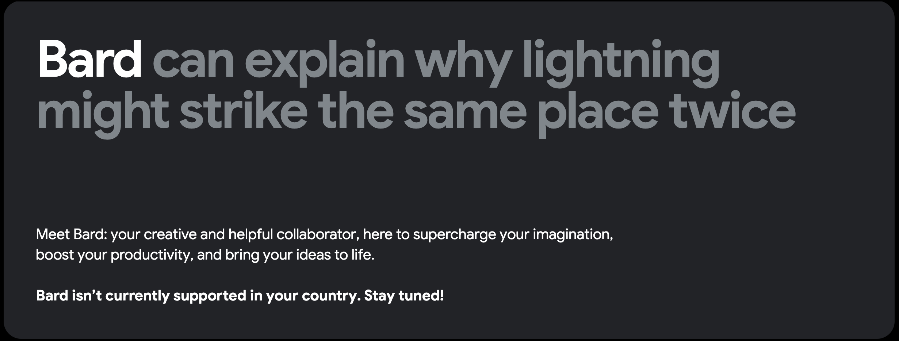

# Competition in the Conversational AI Market

Why choose ChatGPT when there are other options available? Simply put, it's the most popular choice. Even if you're not familiar with IT-related topics, you've probably heard of ChatGPT.

While ChatGPT is strong, it faces competition from Google Bard (LaMDA) and the new Bing AI chat. But there are other alternatives like ChatSonic and Jasper AI that provide more powerful AI solutions and customized conversational experiences. It's important to research and compare these options to find the right fit for your needs and budget. Below, I'll highlight two chosen competitors of ChatGPT.

## 1. Bing

Shortly after the introduction of ChatGPT, Microsoft, the primary investor and partner of OpenAI, integrated a comparable chatbot into its Bing search engine. This chatbot uses [GTP-4](https://www.zdnet.com/article/how-to-use-the-new-bing-and-how-its-different-from-chatgpt/) and can engage in unrestricted text conversations about a wide range of topics. However, it’s the bot's occasionally incorrect, misleading, and weird responses that garnered significant attention following its launch. New York Times tech columnist, Kevin Roose, described his experience of chatting with Bing as “[one of the strangest experiences in my life](https://twitter.com/kevinroose/status/1626216340955758594?ref_src=twsrc%5Etfw%7Ctwcamp%5Etweetembed%7Ctwterm%5E1626217233134526468%7Ctwgr%5Ea6ec04c53b00d357e34ba2de842afffbc74d59e7%7Ctwcon%5Es2_&ref_url=https%3A%2F%2Fmashable.com%2Farticle%2Fmicrosoft-bing-ai-chatbot-weird-scary-responses)”, and he isn't the only one to complain. You can discover more interesting bits here and look at some creative Bing lies following this [link](https://www.reddit.com/r/bing/comments/123muoi/some_creative_lying_from_bing/) to a Reddit post. Now that Microsoft is aware of these issues, it might be on a good path to fix them.

>On that note, it’s good to point out that in the field of artificial intelligence, a phenomenon known as **hallucination** or **artificial hallucination** refers to a confident response from an AI that appears to lack justification based on its training data. This means that the AI may provide answers or information that go beyond what it has been specifically trained on, potentially resulting in fake, inaccurate or unfounded responses.

## 2. Bart (LaMDA)

Google's chatbot Bard made its debut in March 2023 and it was initially available to a select group of users in the United States and the United Kingdom. Originally designed as a creative tool for drafting emails and poems, Bard can generate ideas, write blog posts, and provide factual or opinion-based answers to questions.

Bard’s main advantage over ChatGPT is access to live data on the internet, as OpenAI’s tool is limited to information up to 2021. You can definitely rely on Bard most when it comes to fact seeking. On the other hand, ChatGPT provides multi-lingual support and Google’s chatbot is available only in English ([as of May 2023](https://meetanshi.com/blog/chatgpt-vs-bard-vs-bing/)).

