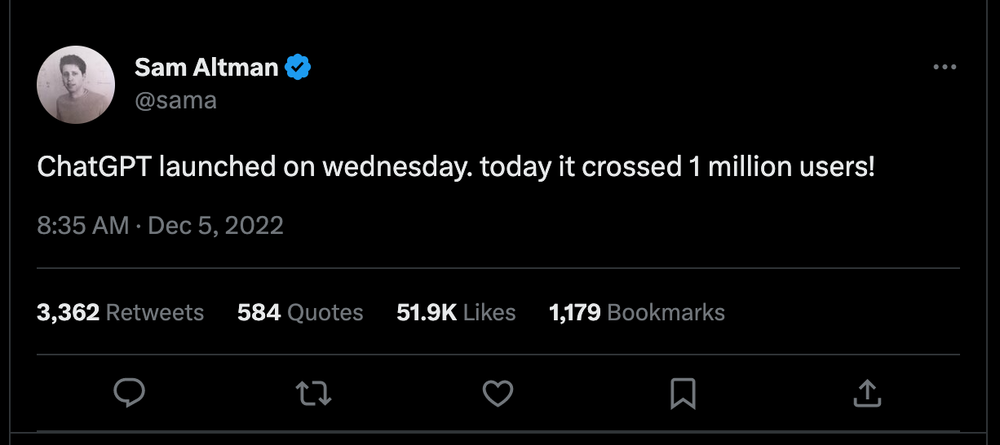

# General Pieces of Information

ChatGPT (**G**enerative **P**re-trained **T**ransformer) is a machine learning model developed by OpenAI that can generate human-like language. It uses deep learning techniques to analyze vast amounts of text data and predict the most likely next word or sentence. As a result, ChatGPT has become a powerful tool for content designers who need to quickly generate large volumes of high-quality content. However, the use of ChatGPT also raises several opportunities, challenges, and ethical considerations.

The rapid adoption of ChatGPT is impressive, with a million users signing up in just five days since it had been made available on November 30th, 2022. For reference, it took [Facebook ten months and Netflix three years](https://www.euronews.com/next/2022/12/14/chatgpt-why-the-human-like-ai-chatbot-suddenly-got-everyone-talking), respectively, to reach the same milestone. The widespread acceptance of ChatGPT and similar tools highlights their immense value to users, indicating that they are quickly becoming an indispensable part of the content design process.

## OpenAI: Empowering Human Potential with ChatGPT

OpenAI, an industry-leading organization founded in 2015, has been at the forefront of advancing artificial intelligence (AI) and driving innovation. With a mission to ensure that artificial general intelligence (AGI) benefits all of humanity, OpenAI has made significant contributions to the AI landscape. One of their remarkable achievements is the development of ChatGPT, an AI-powered language model that has captured the imagination of both professionals and enthusiasts alike.

> We commit to use any influence we obtain over AGI’s deployment to ensure it is used for the benefit of all, and to avoid enabling uses of AI or AGI that harm humanity or unduly concentrate power [(source)](https://openai.com/charter).

 ## A Commitment to Ethical AI

OpenAI has distinguished itself by its commitment to responsible and ethical AI development. They strive to create safe and unbiased AI systems that benefit society as a whole. OpenAI actively engages in ongoing research and engineering to address potential risks and to ensure that AI technologies are designed and deployed in a manner that aligns with human values. By adhering to strict guidelines and continuously refining its models, OpenAI aims to build trust and foster a positive impact on the AI community.

>We will actively cooperate with other research and policy institutions; we seek to create a global community working together to address AGI’s global challenges [(source)](https://openai.com/charter).
 
 OpenAI, despite its significant achievements in AI development, has faced ethical concerns from critics. These concerns include the potential for biases and fairness issues in AI models like ChatGPT, the risk of spreading misinformation and manipulation through AI-generated content, privacy and data security issues, the need for accountability and transparency in AI systems, and the potential unintended consequences of deploying powerful AI models.

 

 Moving forward, we explore the [opportunities](Unlocking%20the%20Potential.md), [challenges](Navigating%20the%20Challenges.md), and [ethical considerations](Navigating%20Ethical%20Considerations.md) of using ChatGPT for content design.
